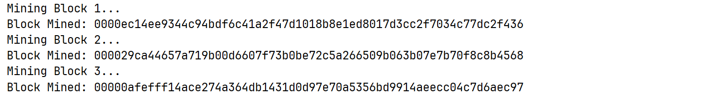
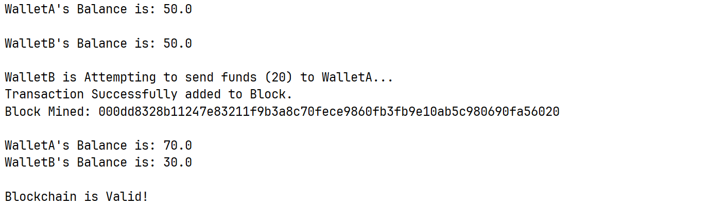

# Blockchain Implementation

This project is a simple blockchain implementation that incorporates core features of blockchain technology and cryptocurrency. It serves as a foundational model to understand how blockchain works, including secure transactions, mining, and validation.

## Features Implemented

### 1. Blockchain Structure & Data Storage

Each block in the blockchain stores transactional data along with metadata such as timestamps and previous block references.
Blocks are linked together using cryptographic hashing, ensuring immutability and security.

### 2. Hash Encryption of Block Data

Every block generates a unique hash based on its data using cryptographic hashing algorithms (e.g., SHA-256).
Ensures data integrity, making tampering nearly impossible without re-mining all subsequent blocks.

### 3. Secure Transactions & Digital Signatures

Users can transfer funds securely through signed transactions.
Digital signatures are implemented using Elliptic-Curve Cryptography (ECC) to verify the authenticity of transactions.
Prevents fraudulent transactions by ensuring only legitimate owners can authorize fund transfers.

### 4. Fraud Prevention & Validation

The blockchain verifies each transaction's legitimacy before adding it to the ledger.
Checks whether a block has been modified by validating hashes, ensuring data consistency.

### 5. Proof-of-Work & Mining

Implements mining through proof-of-work (PoW), requiring computational effort to add a new block.
Users can adjust mining difficulty by setting the number of leading zeros in the hash (e.g., difficulty 4 means the hash must start with four zeros).
Higher difficulty increases security and computational cost, similar to real-world cryptocurrencies.

### 6. Wallet & Key Management

Allows users to create their own wallets using new Wallet();
Each wallet is assigned a unique public-private key pair using ECC.
Transactions require signing with a private key, ensuring ownership verification.

### 7. Sending Signed Transactions

Users can send transactions securely across the blockchain.
Transactions are signed digitally, ensuring they cannot be altered after submission.

## Implementation Details

The project incorporates the following blockchain concepts:

- Block Creation: Each block consists of data, a timestamp, a previous hash, and a cryptographic hash.
- Hash Generation: Each block's hash is computed and linked to the previous block, forming a chain.
- Transaction Validation: Ensures that only valid transactions are recorded, preventing double-spending.
- Mining Mechanism: Uses proof-of-work to add new blocks, maintaining security.
- Difficulty Adjustment: Users can modify mining difficulty to simulate real-world scenarios (e.g., Litecoin had 442,000 leading zeros at one point).
- Wallet & Digital Signatures: Ensures secure transaction authentication using cryptographic keys.
- Testing & Results

The blockchain was tested with various configurations, and screenshots of successful transactions, mining, and block validation are included in the Screenshots directory.

## Future Improvements

- Implementing a peer-to-peer (P2P) network for decentralized transaction validation.
- Enhancing security with more advanced cryptographic techniques.
- Adding smart contract functionality for automated transactions.

This project serves as a strong foundation for blockchain technology, demonstrating key principles such as immutability, cryptographic security, and decentralized transaction verification. It is a valuable addition to any portfolio, showcasing a strong understanding of blockchain fundamentals.

## ScreenShots

### Mining of Blocks

### Creation of Mined Block

### Private and Public Keys Generation and Signature Verification

### Transfers and Transaction, Testing all Features

